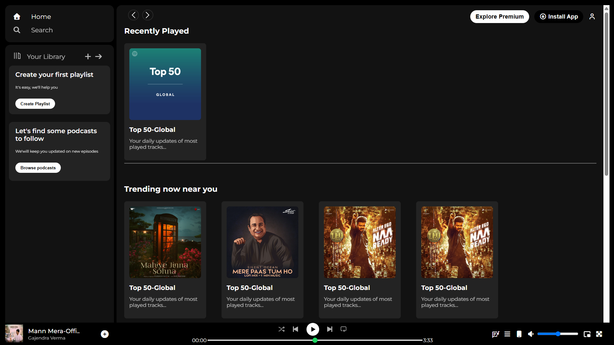

# Spotify Web Player — UI Clone

A pixel-perfect clone of Spotify's Web Player built with **pure HTML and CSS** — no JavaScript, no frameworks, no build tools.



---

## 🚀 Live Demo

> ------------------------------------------

---

## 💡 What Makes This Special

Replicating a production-grade UI like Spotify's forces you to think in real layout systems — not just boxes and colors. This project recreates the three-panel architecture, sticky navigation, a functional looking music player bar, and responsive behavior using only CSS fundamentals.

---

## ✨ Features

- **Three-panel layout** — sidebar, main content, and fixed music player built with `flexbox`
- **Sticky top navigation** — nav bar stays at the top while content scrolls, using `position: sticky` and `z-index`
- **Fixed music player bar** — always visible at the bottom using `position: fixed`
- **Custom range input styling** — progress bar and volume slider styled from scratch with `::-webkit-slider-runnable-track` and `::-webkit-slider-thumb`
- **Responsive hide behavior** — "Explore Premium" and forward navigation button hide on screens under 1000px using `@media` query
- **Hover micro-interactions** — icons fade in on hover (`opacity`), play button scales up on hover (`scale`)
- **Glassmorphism-style cards** — music cards with rounded corners, consistent padding, and `flex-wrap` for natural reflow
- **Google Fonts (Montserrat)** — loaded with `preconnect` for faster font rendering
- **Font Awesome 7 icons** — used throughout nav, player controls, and sidebar
- **Material Symbols** — Google's icon font used for the Lyrics icon in the player

---

## 🗂️ Project Structure

```
spotify-clone/
├── index.html              # Full markup: sidebar, content, music player
├── style.css               # All layout, theming, and interactions
├── logo.png                # Favicon
├── library_icon.png        # Your Library icon
├── backward_icon.png       # Player back button
├── forward_icon.png        # Player forward button
├── player_icon1-5.png      # Shuffle, prev, play/pause, next, repeat icons
├── song_pic.jpg            # Album art in player
├── new_pic_in_pic.png      # Mini player icon
└── card1-6img.jpeg         # Card images for music sections
```

---

## 🛠️ Tech Stack

| Technology | Purpose |
|---|---|
| HTML5 | Semantic page structure |
| CSS3 | Layout, theming, responsiveness, interactions |
| Font Awesome 7 | UI icons throughout |
| Google Fonts (Montserrat) | Typography |
| Material Symbols | Lyrics icon in music player |

**No JavaScript. No React. No Tailwind. Pure HTML & CSS.**

---

## 🧠 Key CSS Concepts Used

| Concept | Where It's Applied |
|---|---|
| `display: flex` | Three-panel layout, player bar, nav options, card rows |
| `position: fixed` | Music player stuck to the bottom of the viewport |
| `position: sticky` | Top nav stays visible while main content scrolls |
| `overflow: auto` | Main content area scrolls independently |
| `flex: 1` | Main content fills remaining space between sidebar and edge |
| `flex-wrap: wrap` | Cards reflow naturally at different screen widths |
| `@media (max-width: 1000px)` | Hides non-essential elements on smaller screens |
| `::-webkit-slider-thumb` | Custom circular thumb on progress and volume sliders |
| `::-webkit-slider-runnable-track` | Custom track styling for range inputs |
| `appearance: none` | Removes browser default range input styles |
| `z-index` | Sticky nav stays above scrolling cards |
| `opacity` + `:hover` | Subtle fade-in interactions across icons and links |
| `scale` on `:hover` | Play/pause button grows on hover |
| `border-radius: 100px` | Pill-shaped buttons (consistent with Spotify's design) |

---

## 📐 Layout Architecture

```
┌─────────────────────────────────────────────────────┐
│                   .main (flexbox)                   │
│  ┌──────────┐  ┌───────────────────────────────┐   │
│  │ .sidebar │  │        .main-content          │   │
│  │          │  │  ┌─────────────────────────┐  │   │
│  │  .nav    │  │  │  .sticky-nav (sticky)   │  │   │
│  │          │  │  └─────────────────────────┘  │   │
│  │ .library │  │  Cards, Sections, Footer...   │   │
│  │          │  │  (scrolls independently)      │   │
│  └──────────┘  └───────────────────────────────┘   │
│                                                     │
│  ┌─────────────────────────────────────────────┐   │
│  │         .music-player (position: fixed)     │   │
│  │  [album info]   [controls + bar]  [volume]  │   │
│  └─────────────────────────────────────────────┘   │
└─────────────────────────────────────────────────────┘
```

---

## 📖 How the Layout Works

**The three-panel split:**
The `.main` div uses `display: flex`. The sidebar has a fixed `width: 340px`. The `.main-content` uses `flex: 1` — meaning it automatically fills all remaining horizontal space. No hardcoded widths needed for the center panel.

**Independent scrolling:**
The `.main-content` has `overflow: auto`, so only the content area scrolls — the sidebar and player bar stay perfectly still. `overflow: hidden` on `body` prevents a double scrollbar.

**Sticky nav that actually sticks:**
The `.sticky-nav` uses `position: sticky; top: 0` with `z-index: 1`. Without the `z-index`, scrolling cards would bleed over the nav.

**Custom range inputs:**
Browser-default range sliders are unstyled and inconsistent. This project removes defaults with `appearance: none` and rebuilds the track and thumb from scratch — the progress bar gets a green thumb matching Spotify's `#1bd760` green.

---

## 🚀 Getting Started

```bash
git clone https://github.com/Yash762816/Spotify-Clone.git
cd spotify-clone
# Open index.html in your browser — no build step needed
```
